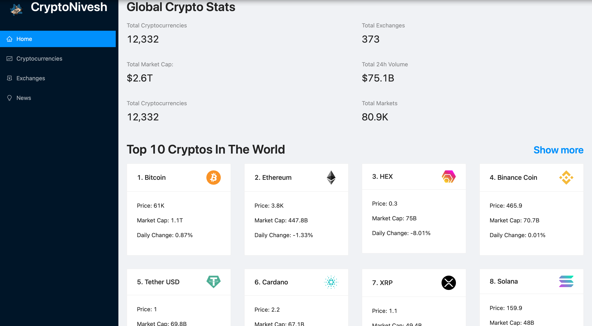
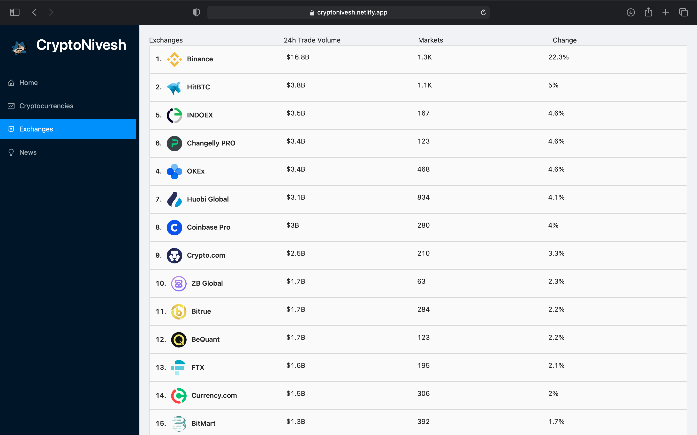

# CryptoNivesh(The react App)

CryptoNivesh is a static website Which Provide Information about
various Cryptocurrencies like their current price , Market capitalization,
Volumes Traded etc. This App is also useful for viewing chart of Different Cryptocurrencies.

## Screenshots

  
## Built With
* HTML
* CSS
* JAVASCRIPT
* REACT, REDUX
* CHART.JS
* RAPID API

  
## Features

- Provides Charts for Different Crypto Currencies
- Provides News about crytocurrencies.
- Gives information about all the cryptocurrencies exchanges
- Toggle menu in small screen
- Search News
- Selected crypto search News
- Search cryptocurrencies
- Responsive

  